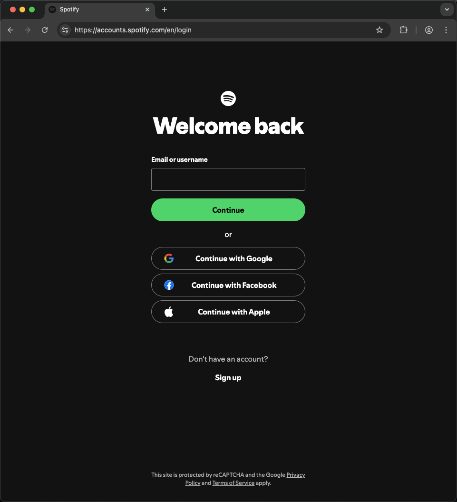
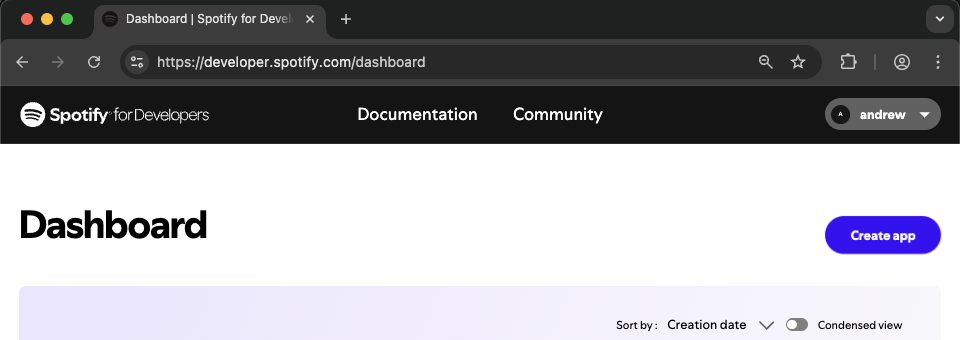
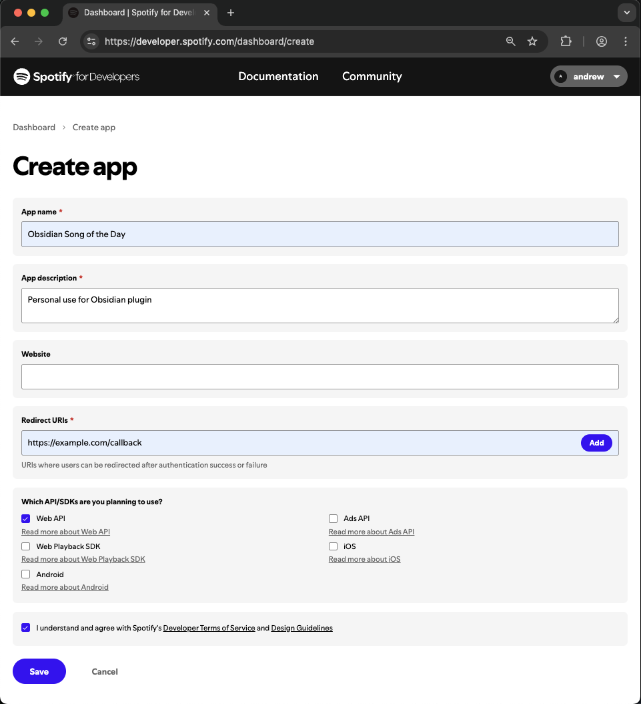
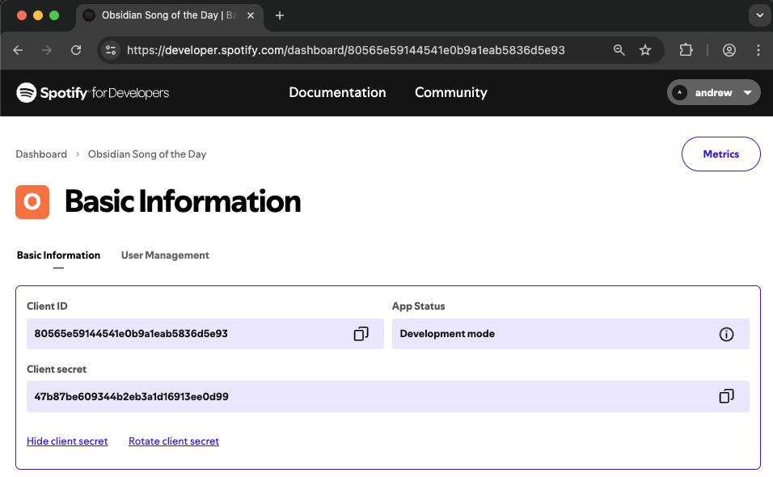

# Song of the Day

An Obsidian plugin that lets you create song notes from Spotify links with metadata and album art.

## Features

- Create notes from Spotify track links or IDs
- Automatically fetch song metadata (title, artist, album, release date, duration)
- Embed album artwork in frontmatter
- Customizable note templates with variable support
- Configurable note naming formats
- Custom date formatting using moment.js

## Setup

### Getting Spotify API Credentials

To use this plugin, you need to create a Spotify application to get API credentials:

1. **Log in to Spotify Developer Dashboard**

   Go to [https://developer.spotify.com/dashboard](https://developer.spotify.com/dashboard) and log in with your Spotify account.

   

2. **Create a new app**

   Click the "Create app" button.

   

3. **Fill out the app form**
   - **App name**: Choose any name (e.g., "Obsidian Song of the Day")
   - **App description**: Add a description (e.g., "For Obsidian plugin")
   - **Redirect URIs**: Leave empty or add any placeholder
   - **APIs used**: Select "Web API"
   - Accept the terms and click "Save"

   

4. **Copy your credentials**

   After creating the app, click "Settings" to view your credentials. You'll need:
   - **Client ID**: Visible on the settings page
   - **Client Secret**: Click "View client secret" to reveal it

   

5. **Add credentials to Obsidian**

   Open Obsidian Settings, go to the "Song of the Day" plugin settings, and paste your Client ID and Client Secret.

## Usage

1. Copy a Spotify track link (e.g., from the Spotify app's share menu)
2. In Obsidian, open the command palette (Cmd/Ctrl + P)
3. Run the command "Create song note"
4. Paste the Spotify link or track ID
5. A new note will be created with song metadata

### Supported Spotify Formats

- Full URL: `https://open.spotify.com/track/3n3Ppam7vgaVa1iaRUc9Lp`
- URI: `spotify:track:3n3Ppam7vgaVa1iaRUc9Lp`
- Track ID: `3n3Ppam7vgaVa1iaRUc9Lp`

## Settings

### Note Settings

- **Output folder**: Where to create song notes (relative to vault root)
- **Note name structure**: Choose what information to include:
  - Song only (e.g., "I Would Die 4 U")
  - Artist - Song (e.g., "Prince - I Would Die 4 U")
  - Song - Artist (e.g., "I Would Die 4 U - Prince")
- **Note name casing**: Choose how to format the text:
  - Original (preserves capitalization)
  - kebab-case (e.g., "i-would-die-4-u")
  - snake_case (e.g., "i_would_die_4_u")
- **Date format**: Customize using moment.js syntax
- **Note template**: Define your note structure using template variables

### Template Variables

Available variables for use in your note template:

- `{{title}}` - Song title
- `{{artist}}` - Primary artist name
- `{{artists}}` - All artists (comma-separated)
- `{{album}}` - Album name
- `{{releaseDate}}` - Album release date
- `{{date}}` - Note creation date (uses your date format setting)
- `{{duration}}` - Song duration in mm:ss format
- `{{spotifyUrl}}` - Link to song on Spotify
- `{{spotifyId}}` - Spotify track ID
- `{{cover}}` - Album cover image URL

## Installation

### Using BRAT (Recommended)

This plugin is not yet available in the Obsidian Community Plugins store. You can install it using the [BRAT plugin](https://github.com/TfTHacker/obsidian42-brat):

1. Install [BRAT](obsidian://show-plugin?id=obsidian42-brat) from the Community Plugins in Obsidian
2. Open the command palette and run the command **BRAT: Add a beta plugin for testing**
3. Enter this repository URL: `https://github.com/snelling-a/obsidian-song-of-the-day`
4. Enable the plugin in Settings > Community Plugins

### Manual Installation

1. Download the latest release from the [releases page](https://github.com/snelling-a/obsidian-song-of-the-day/releases)
2. Extract the files to your vault's plugins folder: `VaultFolder/.obsidian/plugins/obsidian-song-of-the-day/`
3. Reload Obsidian
4. Enable the plugin in Settings > Community Plugins

## Development

### Prerequisites

- Node.js 16 or higher
- npm or yarn

### Setup

```bash
# Clone the repository
git clone https://github.com/snelling-a/obsidian-song-of-the-day.git

# Install dependencies
npm install
```

### Development & Testing

#### Option 1: Using Environment Variable (Recommended)

Set the `VAULT_ROOT` environment variable to automatically copy the built plugin to your vault during development:

**Using a .env file:**

```bash
# Create a .env file in the project root
echo "VAULT_ROOT=/path/to/your/vault" > .env

# Start development build (watches for changes and auto-copies to vault)
npm run dev
```

**Using command line:**

```bash
# Set as environment variable for the session
export VAULT_ROOT=/path/to/your/vault
npm run dev

# Or set inline for a single command
VAULT_ROOT=/path/to/your/vault npm run dev
```

The dev build will automatically:

- Copy built files to `VAULT_ROOT/.obsidian/plugins/obsidian-song-of-the-day/`
- Install and update the [hot-reload plugin](https://github.com/pjeby/hot-reload) for live reloading
- Watch for file changes and rebuild automatically

#### Option 2: Manual Symlink

Alternatively, create a symlink in your vault's plugins folder:

```bash
ln -s /path/to/obsidian-song-of-the-day /path/to/vault/.obsidian/plugins/obsidian-song-of-the-day
npm run dev
```

#### Building for Production

```bash
npm run build
```

## Support

If you encounter any issues or have feature requests, please [open an issue](https://github.com/snelling-a/obsidian-song-of-the-day/issues).

## License

[Unlicense](LICENSE)
